**Baby-C**

Today we are going to decompile the assembly given in the challenge baby-C of Decompetitionv2.0 :

**First of All we are given blocks that have assembly language so we start form the (main:) block**

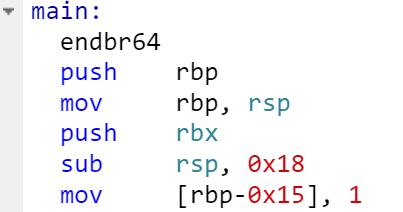

->  Here we can easily see that the program is pushing RBP(base pointer register) and RSP(Stack pointer Register) into the Stack for the program to be able to use it.

**Now we move onto (block 1) as (main:) block was not doing much for us**

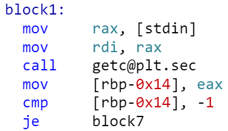

->Here we observe that RAX(Accumulator Register) is made to take the input from the user.

->Then we give it as an argument of the function "getc()" and then store it at an address 0x14 below the base pointer

->Then we are comparing the input with -1 and if that happens we will jump to the (block7) of the program

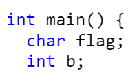

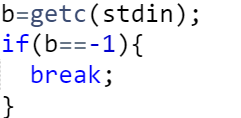

	
->We have made two variables flag and b as we can see that the assembly is making space on the stack and marking one as stdin variable thus two variables are declared and b is input from the user.

->Here we have added the break statement inside the if condition (b==-1) because of the statements of (block 7:) as if the value is -1 for the variable b then it will jump to (block 7).

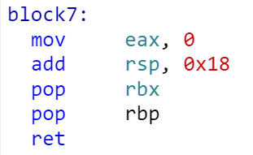

->The (block 7) basically exits or returns the program by popping RBP and RSP out of the Stack.

->So we can assume that whichever block enters the (block 7) will break a loop or return the program

**Now we assume that we donot have value of b equal to -1 then we will move to (block 2):**

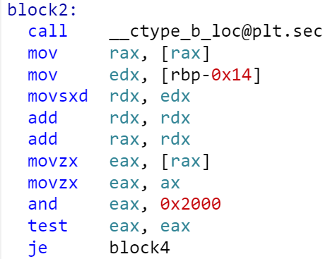

->In this block we are calling the function '__ctype_b_loc@plt.sec' and basically checking the condition:

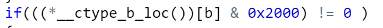

->This statement is equivalent to (isalpha==0) or it checks if the given argument character is an alphabet or not . And if the given argument is an alphabet then it will jump to (block 4)

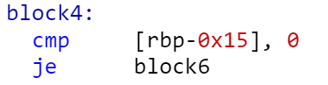

**Now let us assume that the address (rbp-0x15) or our input variable does'nt store the value 0 . Then it will goto (block 5), then next block:**

->In this block we can easily see that the 'toupper()' function is being called with the argument as our input varaible and then putc is called to print it . Thus :

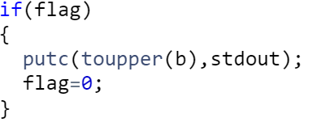

->Here if statement will check for flag=1 or not and then flag variable is set to 0 

->But the last statement of the block tells us to go back to (block1) again so we can assume that a loop is going on for our whole program.

->So we are going to add a while loop in our program :

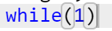

**Now we assume that our flag variable was 0 when we decided to compare it in (block 4) then we will jump to (block 6):**

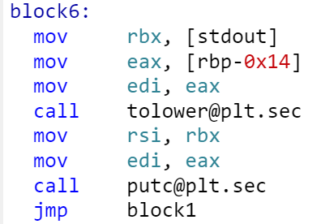

->This is also similar to the (block 5) while it is calling 'tolower()' with the argument given in the (EDI) register (the 32 bit version of RDI).

->This also ends at block 1 again so this will also come in the block of our while loop

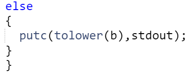

**Here we backtrace the assembly and observe that if the character is not an alphabet then flag variable is as it is while it is set to 1 if the 'b' variable is an alphabet.**

**Thus at last our decompiled code becomes:**

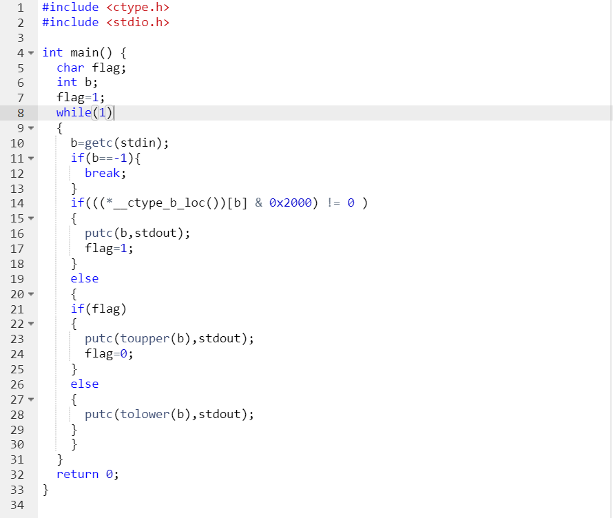

**And here we receive 100% score  😊**

