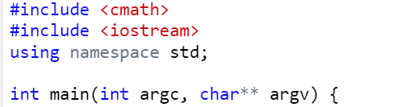
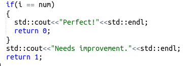

# **baby-CPP**

- Above is the first block of the assembly program given that is accessing the Command-line Arguments and storing them in (rbp-0x14) and (rbp-0x20).

- We should know that when we put Command-line Arguments then we have to input a vector having its first argument as the name of the executable file and then all the arguments we want to give.

**This gives us our first statement:**

**Now we shall see the (block 1) of the assembly:**

- We compare the first argument of the Command-Line Vector := argc to 2 or we simply check if there are 2 arguments given to the command line.

- If the arguments are not 2 then ->

- The first two statements describes that "USAGE: ./grade n" has to be printed as an error output statement.

- Also the exit() function is called with EDI equal to 2.

**Thus our code becomes:**

- If the argument count is not 2 then we will jump to block 2 :

- Here we can easily observe that the program is converting 1st index argument of the vector (argv) to an integer using 'atoi()' function and storing it inside a variable on the stack.

- Then another variable on the stack is set to 1, at the 7th line of the block.

- Also here we compare the converted number variable (num) to 0 and if it is less or equal to 0, then we move onto the next block (block 3).

- This block prints the string "Don't be so negative." as an error output. Also it uses endl after that.

- Then it exits the program using the argument 2 in the RDI register.

**Thus our code becomes:**

**Now we move onto the next block (block 4)**

- We will move here only if num variable is not equal to 0->

- In this block the program is using 'sqrt()' function to evaluate the sqaure root of the 'num' variable value and store it into the variable that I named cnt.

**Thus we got our statement to add:**

**Now the next block is:**

- This tells us that the program compares the value stored at (rbp-8) in  the stack or one of the variable with 1.

- Also we can infer that this above can be said a while loop until cnt variable is more than 1 as then only it will get oht of the loop and go to block9.

**Thus our code becomes:**

- This happens because we will see in the next block sections(block6 and block7) we can transform the calculations into the given code.

- Now let us break out of the loop or simply say set 'cnt' variable to less than or equal to 1.

- These instructions tell us that we will jump to block11 if 'num' variable is not equal to 1.

- If not then this block will execute:

**Making our code:**

- The correct if statement if fulfilled then the block10 will be executed making our code giving us the if statement.

### **THUS OUR FINAL CODE IS:**

